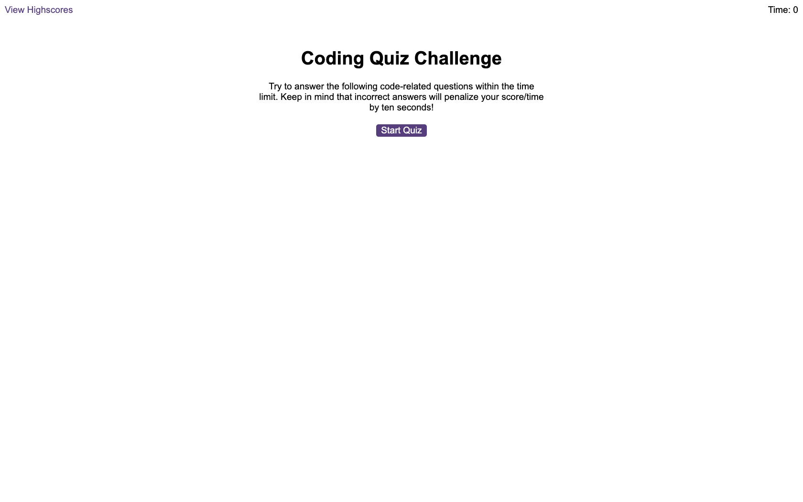
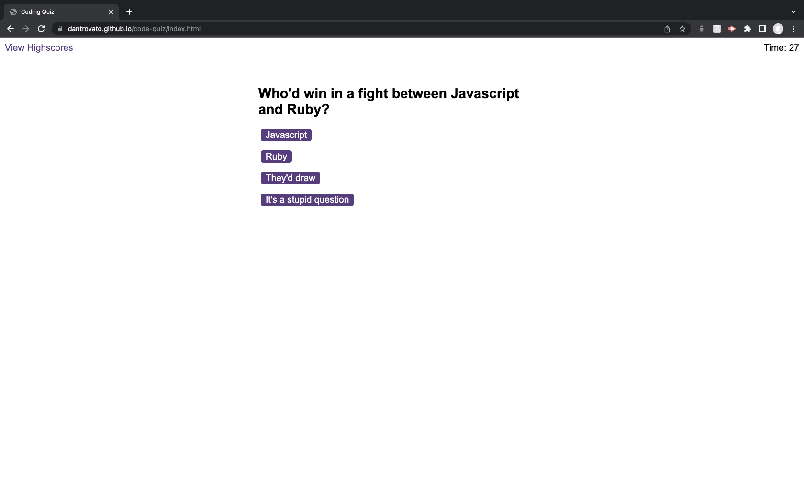
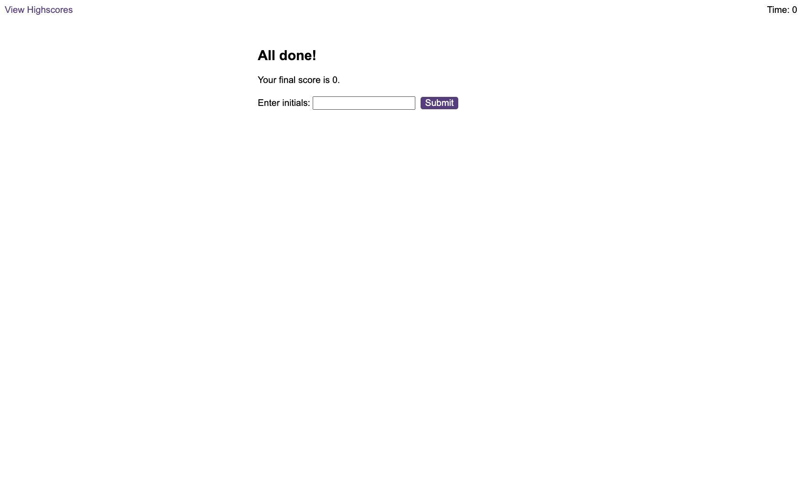

# Quix

## Description

A multiple choice quiz with a timer. When the user gets an answer wrong the timer deducts 10 seconds.
The remaining time is a player's final score. When all the questions have been answered or the timer has run out the player
has the option to enter their name and are shown a list of all the scores ranked from best to worst. The player has then the option to clear all the scores

The application doesn't currently allow players to input the same name twice. The details are not entered into the highscores if the name already exists.

